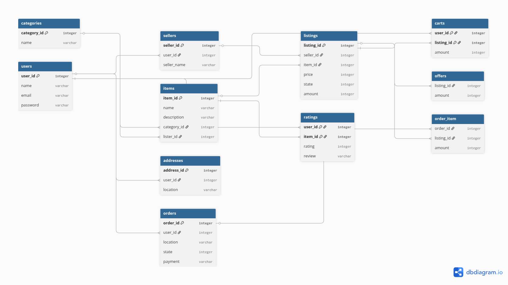

# FastApi e-commerce

This is a multi-seller marketplace REST API built with FastAPI and SQLAlchemy Core, featuring JWT auth, role-based access, cart management, order processing, and a purchase-verified review system.

## How to run it locally

git clone https://github.com/ma7amed77/e-commerce-backend
cd e-commerce-backend
pip install -r requirements.txt
uvicorn main:app --reload

## Interactive api doc (readonly database)

[Interactive api doc](https://e-commerce-backend-ma7amed77143-7mh2cnla.leapcell.dev/docs)

(clone the project to test adding and ordering)

It doesn't have content filtering so I can't leave it open on the internet 😄

### Some Testing data

| Email               | Password          |
|---------------------|-------------------|
| alice@example.com   | hashed_password_1 |
| bob@example.com     | hashed_password_2 |
| charlie@example.com | hashed_password_3 |

The project doesn't have password hashing as this is a showcase for the systems so DO NOT USE REAL DATA please 😄

## How is it structured

### Items

Items include name and general data about the item.
* Multiple sellers can sell the same item
* Items are created once, listings define price & stock

### Listings
#### Listings represent:
* Price
* Stock
* Seller

Listings define the price and stock for an item. Each seller can create their own listing for any existing item." and replace with just: "This allows multiple sellers to compete on the same product with independent pricing.

### Users & Sellers

Usually it will require manual checking for legal papers to become a seller, but as this is for showcase users can just add a shop name while providing their JWT token to become a seller. (if api called again it will just update the name)

### Ratings & reviews

Users can rate items and optionally leave a written review.
To leave a review user must have an order with this item.

### Carts

Carts are connected to listings not items as user can choose which price/seller to buy item from.

User can:

* Add item to cart (if item in cart it will add one).
* Update a cart item's quantity.
* Remove the listing.

### Locations

Locations are saved addresses so users don't have to re-enter delivery details on every order.

### Items Page & Search

Items page and search collects data from Items and ratings and prices and seller name from Listings. This data is then used to filter and search.

## Database

The project started with SQLite for faster dev but for production a server based sql like PostgreSQL is a must, as SQLite doesn't have row locking so the whole database will be locked when ordering. also SQLite doesn't support async operations.

## Authentication

Authentication uses JWT tokens storing user_id and seller_id (for sellers), enabling role-based access control across all protected endpoints.
